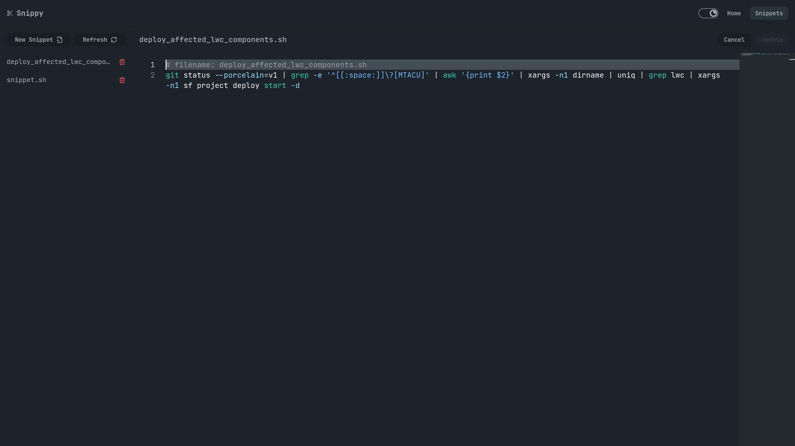
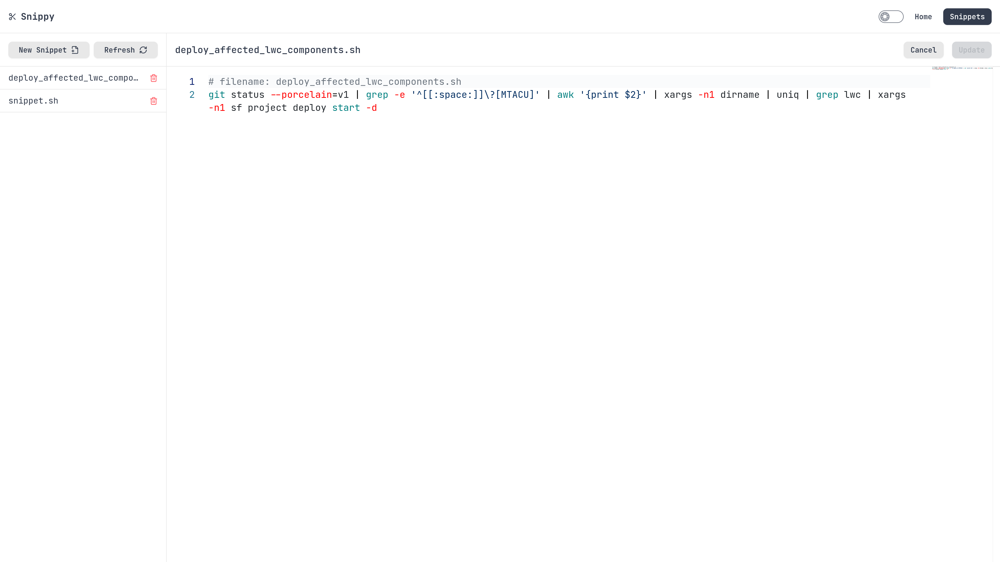

# Snippy

Snippy is a simple one binary tool to manage your snippets.

## Screenshots

| Dark                              | Light                              |
| --------------------------------- | ---------------------------------- |
|  |  |

## Installation

```bash
# Requires sqlite3 library
$ pnpm build
$ ./snippy

# or via docker
$ docker build -t snippy .
$ docker run -p 8080:8080 -v ./snippet.sqlite:/app/snippet.sqlite snippy
```

## Features

- [x] Web based UI
- [x] Dark and Light mode
- [x] Snippets
  - [x] Create
  - [x] Read
  - [x] Update
  - [x] Delete
- [x] Server
- [x] Docker
- [ ] CLI Client
